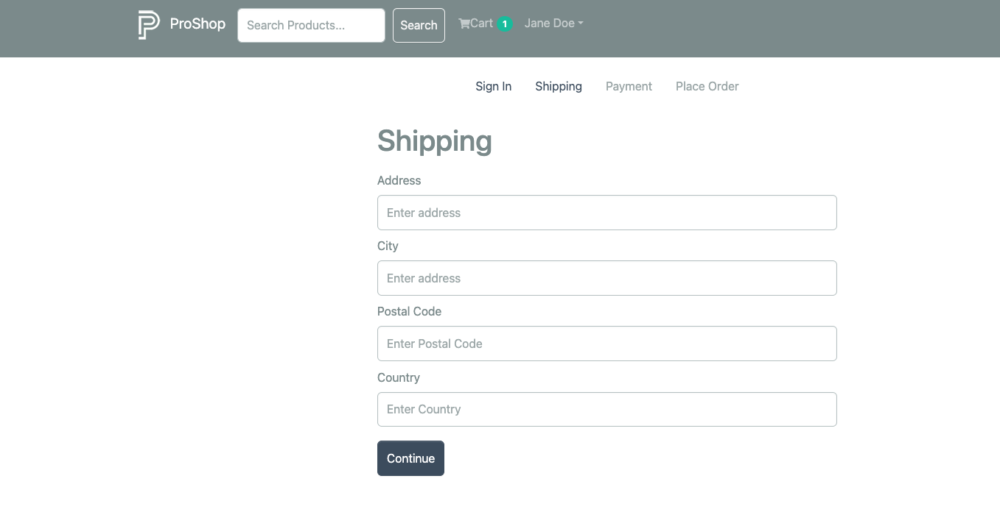
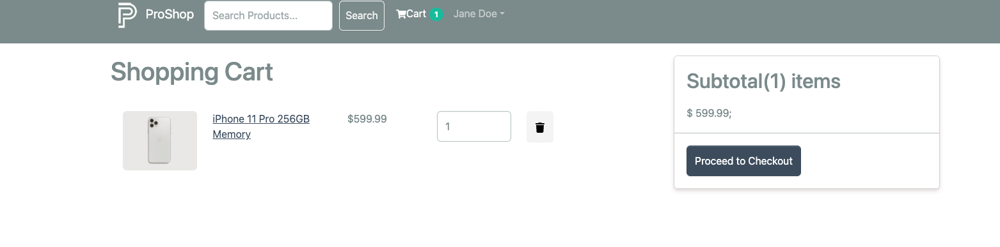
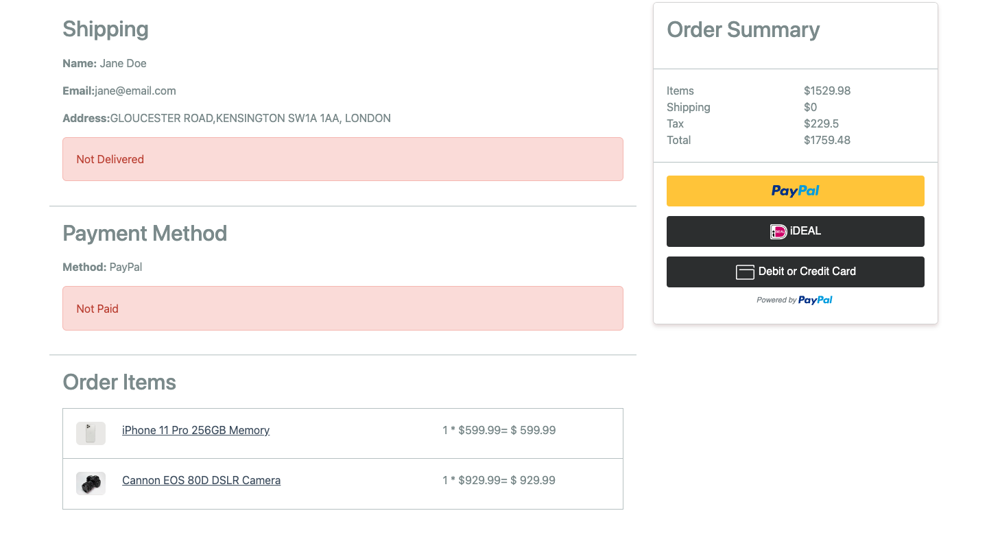

eCommerce Platform
This project was created with dedication by "Zeynep Sariteke" based on the Udemy course "Build an eCommerce platform from the ground up with React, Redux Toolkit, Express & MongoDB" by Brad Traversy. It is a detailed full stack eCommerce platform built using modern technologies.

Table of Contents
Introduction
Features
Technologies
Installation
Usage
Deployment
Screenshots
License
Introduction

This project is a comprehensive eCommerce platform that includes all the major features needed to run an online store.

Features
User authentication with JWT
Admin dashboard for managing products, users, and orders
Product browsing and searching
Shopping cart functionality
Order management
Payment processing with PayPal
Product reviews and ratings
Responsive design for mobile and desktop
Technologies
Admin Dashboard

Frontend:

React
Redux Toolkit
React Router
Bootstrap
Backend:

Node.js
Express
MongoDB
Mongoose
Other:

JWT (JSON Web Tokens)
PayPal API
Bcrypt.js (for password hashing)
Installation

Clone the repository:

git clone https://github.com/zsaritek/proshop-demo

Create a .env file in the backend directory and add the following:

env
Copy code
NODE_ENV=development
PORT=8000
MONGO_URI=your_mongodb_connection_string
JWT_SECRET=your_jwt_secret
PAYPAL_CLIENT_ID=your_paypal_client_id
PAGINATION_LIMIT=8

Usage
To use the application, navigate to http://localhost:8000 in your browser. You can browse products, add them to your cart, and proceed to checkout. Admin functionalities are available by logging in with an admin account.

Deployment
This project is deployed via Render. You can access the live version of the application at:
https://proshop-420w.onrender.com/

To deploy your own version on Render, follow these steps:

Create a new Web Service for the backend:

Connect your GitHub repository.
Select the root directory of the backend.
Set up environment variables as per the .env file.
Create a new Web Service for the frontend:

Connect your GitHub repository.
Select the root directory of the frontend.
Configure the build and start commands.
Refer to the Render documentation for detailed deployment instructions.

Screenshots

License
This project is licensed under the MIT License. See the LICENSE file for details.

